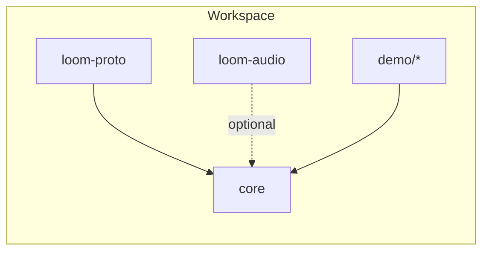

## Loom Core — Overview

This document summarizes the `core` crate: responsibilities, data flow, dependencies within the workspace, and a brief routing strategy overview. The tone is objective and intended for maintainers and integrators.

### Purpose

The `core` crate implements runtime primitives for agents, routing, capability invocation, event handling, context management, and telemetry. It serves as the foundation for demos and external integrations.

### Data flow (minimal closed loop)

1. An event is published to the EventBus.
2. The EventBus delivers to AgentRuntime and the Model Router as applicable.
3. AgentRuntime executes behavior and invokes tools via ToolRegistry.
4. The tool executes and returns a result.
5. The result is published back to the EventBus.

### Workspace dependencies (at a glance)



### Notes

- `loom-proto` defines shared protobuf types used by `core` and other crates.
- `loom-audio` provides audio capabilities (VAD/STT/TTS) and integrates with runtime primitives from `core`.

### Component map (links)

- EventBus — `docs/core/event_bus.md`
- Agent Runtime — `docs/core/agent_runtime.md`
- Cognitive Runtime — `docs/core/cognitive_runtime.md`
- Router — `docs/core/router.md`
- Memory & Context — `docs/core/memory.md`
- LLM Client — `docs/core/llm.md`
- Collaboration — `docs/core/collaboration.md`
- Telemetry — `docs/core/telemetry.md`

### Routing strategy (overview)

Routing evaluates policy dimensions and emits a decision and reason codes:

- Privacy and data residency constraints
- Latency budgets and observed performance
- Cost ceilings
- Quality thresholds and capability matching

When no route matches, a no-match decision is produced and may be published as a `routing_decision` event for observability.

### Source layout

```
core/src/
├── agent/           # Agent definitions and lifecycle
│   ├── behavior.rs    # AgentBehavior trait
│   ├── directory.rs   # Agent/capability discovery
│   ├── instance.rs    # Running agent with mailbox
│   └── runtime.rs     # Agent lifecycle manager
│
├── cognitive/       # LLM-powered reasoning (Perceive-Think-Act)
│   ├── llm/           # LLM client, router, providers
│   ├── memory_buffer.rs # Simple in-process memory
│   ├── simple_loop.rs # Main cognitive loop implementation
│   ├── thought.rs     # Plan, ToolCall, Observation types
│   └── config.rs      # Thinking strategies
│
├── context/         # Context Engineering system
│   ├── agent_context.rs  # High-level API for agents
│   ├── memory/           # Storage backends (InMemory, RocksDB)
│   ├── retrieval/        # Retrieval strategies
│   ├── ranking/          # Context ranking
│   ├── window/           # Token budget management
│   ├── pipeline/         # Context orchestration
│   └── storage.rs        # Legacy RocksDB wrapper
│
├── tools/           # Unified tool system
│   ├── registry.rs    # Tool registration and invocation
│   ├── traits.rs      # Tool trait definition
│   ├── native/        # Built-in tools (shell, file, weather)
│   └── mcp/           # Model Context Protocol client
│
├── event.rs         # EventBus with QoS levels
├── envelope.rs      # Thread/correlation metadata
├── collab.rs        # Multi-agent collaboration primitives
├── dashboard/       # Real-time visualization
└── telemetry.rs     # OpenTelemetry tracing
```

End of overview.
