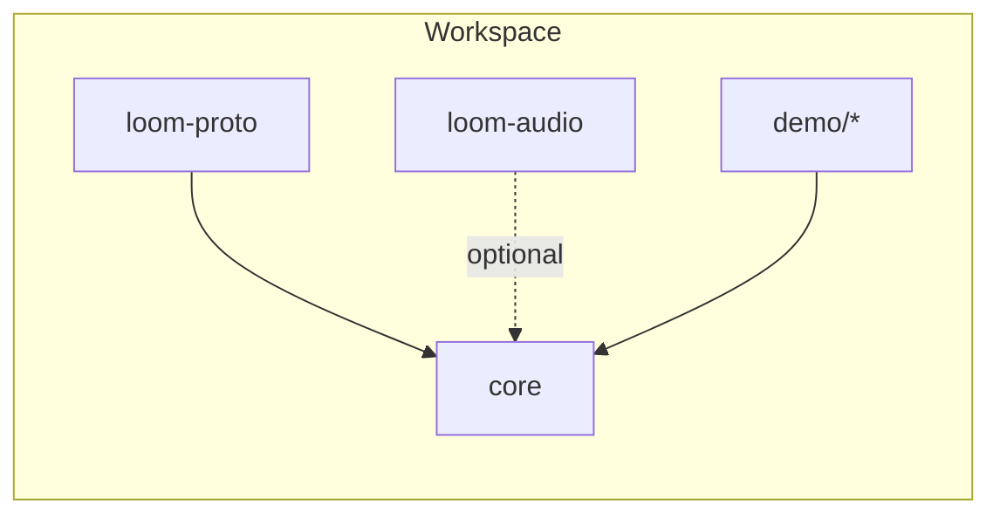

## Loom Core — Overview

This document summarizes the `core` crate: responsibilities, data flow, dependencies within the workspace, and a brief routing strategy overview. The tone is objective and intended for maintainers and integrators.

### Purpose

The `core` crate implements runtime primitives for agents, routing, capability invocation, event handling, storage, and telemetry. It serves as the foundation for demos and external integrations.

### Data flow (minimal closed loop)

1. An event is published to the EventBus.
2. The EventBus delivers to AgentRuntime and the Model Router as applicable.
3. AgentRuntime executes behavior and invokes capabilities via ActionBroker.
4. The capability executes and returns a result.
5. The result is published back to the EventBus.

### Workspace dependencies (at a glance)

### Notes

- `loom-proto` defines shared protobuf types used by `core` and other crates.
- `loom-audio` provides audio capabilities (VAD/STT/TTS) and integrates with runtime primitives from `core`.

### Component map (links)

- EventBus — `docs/core/event_bus.md`
- Agent Runtime — `docs/core/agent_runtime.md`
- Router — `docs/core/router.md`
- ActionBroker — `docs/core/action_broker.md`
- LLM Client — `docs/core/llm.md`
- Plugin System — `docs/core/plugin_system.md`
- Storage — `docs/core/storage.md`
- Telemetry — `docs/core/telemetry.md`

### Routing strategy (overview)

Routing evaluates policy dimensions and emits a decision and reason codes:

- Privacy and data residency constraints
- Latency budgets and observed performance
- Cost ceilings
- Quality thresholds and capability matching

When no route matches, a no-match decision is produced and may be published as a `routing_decision` event for observability.

### Source layout

- `core/src/` — top-level modules: `event.rs`, `router.rs`, `action_broker.rs`, `storage.rs`, `telemetry.rs`, `plugin.rs`, `local_model.rs`.
- `core/src/agent/` — `runtime.rs`, `instance.rs`, `behavior.rs`.
- `core/src/llm/` — `adapter.rs`, `client.rs`, `provider.rs`.
- `core/benches/` — benchmarks and pressure tests (EventBus throughput/latency).

End of overview.
