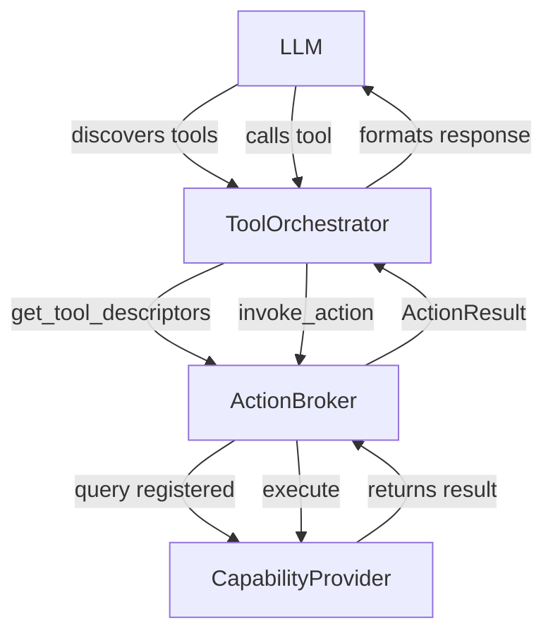

## Loom Core — Providers

This document describes the capability providers system in the `core` crate: architecture, built-in providers, extension patterns, and integration with the ActionBroker and LLM tool orchestration.

### Purpose

Providers implement concrete capabilities that agents can invoke through the ActionBroker. They expose structured interfaces (OpenAI-compatible tool schemas) that LLMs can discover and call, enabling agents to interact with external systems, APIs, and data sources.

### Architecture



### CapabilityProvider Trait

All providers implement the `CapabilityProvider` trait:

```rust
#[async_trait]
pub trait CapabilityProvider: Send + Sync {
    /// Returns metadata about this provider
    fn descriptor(&self) -> ToolDescriptor;

    /// Executes the capability with given parameters
    async fn invoke(&self, params: HashMap<String, String>) -> ActionResult;
}
```

**ToolDescriptor** contains:

- `name`: Capability identifier (e.g., "web.search", "weather.get")
- `version`: Semantic version string
- `description`: Human-readable explanation for LLMs
- `parameters_schema`: OpenAI-compatible JSON Schema defining required/optional parameters

### Built-in Providers

#### Web Search Provider

**Capability**: `web.search`
**API**: DuckDuckGo Instant Answer API (free, no authentication)
**Parameters**:

- `query` (required, string): Search query

**Example**:

```rust
let provider = WebSearchProvider::new();
let mut params = HashMap::new();
params.insert("query".to_string(), "rust async programming".to_string());
let result = provider.invoke(params).await?;
```

**Features**:

- Instant answers and summaries
- Related topics extraction
- Automatic URL encoding
- Graceful fallback when no results found

**Configuration**: See `core/src/providers/web_search.rs`

#### Weather Provider

**Capability**: `weather.get`
**API**: Open-Meteo API (free, no authentication, automatic geocoding)
**Parameters**:

- `location` (required, string): City name, address, or coordinates
- `units` (optional, string): "celsius" (default) or "fahrenheit"

**Example**:

```rust
let provider = WeatherProvider::new();
let mut params = HashMap::new();
params.insert("location".to_string(), "San Francisco".to_string());
params.insert("units".to_string(), "fahrenheit".to_string());
let result = provider.invoke(params).await?;
```

**Features**:

- Automatic geocoding (city name → coordinates)
- Current weather conditions
- Temperature, humidity, wind speed, pressure
- WMO weather codes → human-readable descriptions
- Celsius/Fahrenheit support

**Configuration**: See `core/src/providers/weather.rs`

### Integration with ActionBroker

Providers must be registered with the ActionBroker during initialization:

```rust
use loom_core::action_broker::{ActionBroker, CapabilityProvider};
use loom_core::providers::{WebSearchProvider, WeatherProvider};

let broker = ActionBroker::new();

// Register providers
broker.register_capability(
    "web.search",
    Box::new(WebSearchProvider::new())
).await?;

broker.register_capability(
    "weather.get",
    Box::new(WeatherProvider::new())
).await?;
```

Once registered, capabilities are:

1. Discoverable via `broker.get_tool_descriptors()`
2. Invokable via `broker.invoke_action(name, params)`
3. Available to LLMs through ToolOrchestrator

### Integration with LLM Tool Orchestration

The ToolOrchestrator bridges LLM tool calls to ActionBroker invocations:

```rust
use loom_core::llm::ToolOrchestrator;

let orchestrator = ToolOrchestrator::new(broker);

// LLM discovers available tools
let tools = orchestrator.get_tool_descriptors().await;

// LLM makes tool call
let tool_call = /* parsed from LLM response */;
let result = orchestrator.execute_tool_call(tool_call).await?;
```

**Flow**:

1. LLM receives tool schemas from `get_tool_descriptors()`
2. LLM decides to call a tool and formats the request
3. ToolOrchestrator parses the call (Responses API or Chat API format)
4. ToolOrchestrator invokes the capability via ActionBroker
5. Result is formatted back to LLM

See `docs/TOOL_USE_GUIDE.md` for complete LLM integration examples.

### Creating Custom Providers

#### Step 1: Implement CapabilityProvider

```rust
use loom_core::action_broker::{CapabilityProvider, ToolDescriptor, ActionResult};
use async_trait::async_trait;
use std::collections::HashMap;

pub struct MyCustomProvider {
    // Configuration fields
}

#[async_trait]
impl CapabilityProvider for MyCustomProvider {
    fn descriptor(&self) -> ToolDescriptor {
        ToolDescriptor {
            name: "custom.action".to_string(),
            version: "1.0.0".to_string(),
            description: "Does something useful".to_string(),
            parameters_schema: serde_json::json!({
                "type": "object",
                "properties": {
                    "param1": {
                        "type": "string",
                        "description": "First parameter"
                    }
                },
                "required": ["param1"]
            }),
        }
    }

    async fn invoke(&self, params: HashMap<String, String>) -> ActionResult {
        // 1. Validate required parameters
        let param1 = params.get("param1")
            .ok_or_else(|| "Missing required parameter: param1")?;

        // 2. Execute capability logic
        let result = self.do_something(param1).await?;

        // 3. Return structured result
        Ok(serde_json::json!({
            "status": "success",
            "data": result
        }))
    }
}
```

#### Step 2: Add Tests

Create tests in `core/tests/providers_test.rs`:

```rust
#[cfg(test)]
mod custom {
    use super::*;

    #[tokio::test]
    async fn test_descriptor() {
        let provider = MyCustomProvider::new();
        let descriptor = provider.descriptor();
        assert_eq!(descriptor.name, "custom.action");
    }

    #[tokio::test]
    async fn test_invoke() {
        let provider = MyCustomProvider::new();
        let mut params = HashMap::new();
        params.insert("param1".to_string(), "test".to_string());
        let result = provider.invoke(params).await;
        assert!(result.is_ok());
    }
}
```

#### Step 3: Register Provider

Add to `core/src/providers/mod.rs`:

```rust
mod custom;
pub use custom::MyCustomProvider;
```

Register in your application:

```rust
broker.register_capability(
    "custom.action",
    Box::new(MyCustomProvider::new())
).await?;
```

### Error Handling

Providers should return `ActionResult`:

- `Ok(serde_json::Value)` for successful execution
- `Err(String)` for failures (e.g., missing parameters, API errors)

**Best practices**:

- Validate all required parameters first
- Use descriptive error messages (LLMs see these)
- Include error codes for programmatic handling
- Log errors with structured tracing

Example error handling:

```rust
async fn invoke(&self, params: HashMap<String, String>) -> ActionResult {
    // Required parameter
    let query = params.get("query")
        .ok_or_else(|| "Missing required parameter: query".to_string())?;

    // Validation
    if query.trim().is_empty() {
        return Err("Parameter 'query' cannot be empty".to_string());
    }

    // API call with error handling
    let response = self.client.get(&url)
        .send()
        .await
        .map_err(|e| format!("API request failed: {}", e))?;

    // Parse response
    let data: ApiResponse = response.json()
        .await
        .map_err(|e| format!("Failed to parse response: {}", e))?;

    Ok(serde_json::json!(data))
}
```

### Testing Strategy

**Unit Tests** (`core/tests/providers_test.rs`):

- Descriptor validation (name, version, schema structure)
- Parameter validation (required, optional, empty values)
- API invocation (when network available)
- Error handling (missing params, API failures)

**Integration Tests** (`core/tests/integration/e2e_tool_use.rs`):

- Full ToolOrchestrator → ActionBroker → Provider flow
- LLM tool discovery and execution
- Tool call parsing (Responses API, Chat API)
- Multiple tool calls and refinement

**Running tests**:

```bash
# All provider tests
cargo test --test providers_test

# Specific provider
cargo test --test providers_test web_search

# Integration tests
cargo test --test integration_test e2e_tool_use
```

### Configuration

Providers can accept configuration through constructors:

```rust
pub struct WeatherProvider {
    client: reqwest::Client,
    config: WeatherConfig,
}

pub struct WeatherConfig {
    pub default_units: String,
    pub timeout_secs: u64,
}

impl WeatherProvider {
    pub fn new() -> Self {
        Self::with_config(WeatherConfig::default())
    }

    pub fn with_config(config: WeatherConfig) -> Self {
        Self {
            client: reqwest::Client::builder()
                .timeout(Duration::from_secs(config.timeout_secs))
                .build()
                .unwrap(),
            config,
        }
    }
}
```

### Performance Considerations

**Timeouts**: Set reasonable HTTP client timeouts (10-30 seconds)
**Caching**: Consider caching API responses for repeated queries
**Rate Limiting**: Implement rate limiting for external APIs
**Async**: All providers must be async (use `#[async_trait]`)
**Connection Pooling**: Use shared `reqwest::Client` for connection reuse

### Security Considerations

**API Keys**: Store in environment variables, not hardcoded
**Input Validation**: Sanitize all user inputs before API calls
**URL Encoding**: Properly encode parameters to prevent injection
**HTTPS**: Use rustls-tls for secure connections
**Error Messages**: Don't leak sensitive information in error responses

Example secure configuration:

```rust
pub fn new() -> Self {
    let api_key = std::env::var("API_KEY")
        .expect("API_KEY environment variable not set");

    Self {
        client: reqwest::Client::builder()
            .timeout(Duration::from_secs(30))
            .build()
            .unwrap(),
        api_key,
    }
}
```

### Observability

Use structured logging with tracing:

```rust
use tracing::{info, warn, error};

async fn invoke(&self, params: HashMap<String, String>) -> ActionResult {
    let query = params.get("query")
        .ok_or_else(|| "Missing required parameter: query")?;

    info!(
        target: "loom::providers::web_search",
        query = %query,
        "Executing web search"
    );

    match self.search(query).await {
        Ok(results) => {
            info!(
                target: "loom::providers::web_search",
                result_count = results.len(),
                "Search completed"
            );
            Ok(serde_json::json!(results))
        }
        Err(e) => {
            error!(
                target: "loom::providers::web_search",
                error = %e,
                "Search failed"
            );
            Err(format!("Search failed: {}", e))
        }
    }
}
```

### Source Layout

- `core/src/providers/mod.rs` — Module exports
- `core/src/providers/web_search.rs` — Web search provider (DuckDuckGo)
- `core/src/providers/weather.rs` — Weather provider (Open-Meteo)
- `core/tests/providers_test.rs` — Unit tests for all providers
- `core/tests/integration/e2e_tool_use.rs` — Integration tests

### Related Documentation

- ActionBroker — `docs/core/action_broker.md`
- LLM Client — `docs/core/llm.md`
- Tool Use Guide — `docs/TOOL_USE_GUIDE.md`
- Provider Usage Examples — `core/src/providers/README.md`

### Future Enhancements

- **Plugin System**: Dynamic provider loading from shared libraries
- **Provider Registry**: Centralized marketplace for community providers
- **Streaming Responses**: Support for long-running operations
- **Batch Operations**: Execute multiple provider calls in parallel
- **Provider Metrics**: Built-in performance and usage tracking

End of providers documentation.
