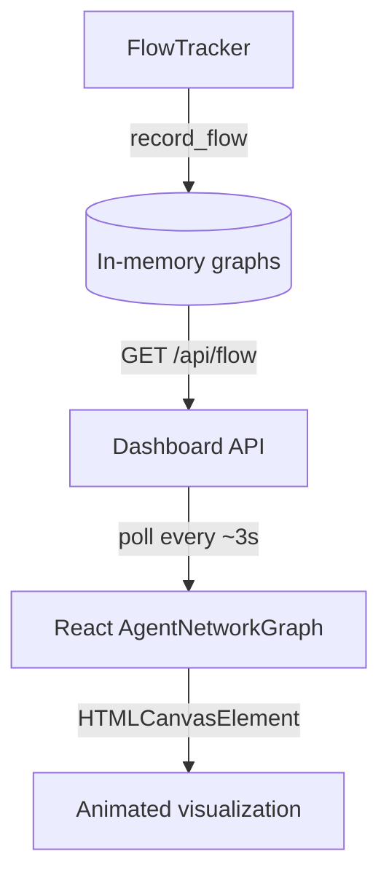

# Dashboard Event Flow Visualization - Usage Guide

## Overview

The dashboard renders a live **Agent Network Graph** powered by `FlowTracker`. It shows how events move between agents, the EventBus, tools, and routers using an animated HTML canvas. Each particle represents a recent message, letting you spot active conversations at a glance.

## Graph Capabilities

- **Circular Layout**: Agents and system nodes are positioned on a ring for quick scanning.
- **Animated Particles**: New flows spawn glowing particles that travel along their edge.
- **Status Glow**: Node halos communicate activity — bright teal for active (<5 s), green for processing (≤30 s), and slate for idle.
- **Capability Summary**: Cards beneath the visualization list each agent, its status, and capability count.
- **Auto-Pruned Data**: FlowTracker keeps a rolling 60 s window to avoid runaway memory usage.

## Quick Test

```bash
# Build dashboard assets (first run or after frontend changes)
cd core/src/dashboard/frontend
npm install
npm run build
cd ../../..

# Start the demo event pipeline + dashboard
export LOOM_DASHBOARD_PORT=3030
cargo run --example dashboard_demo

# View the graph
open http://localhost:3030
```

## Data Pipeline

1. `FlowTracker::record_flow()` records `(source, target, topic)` edges with timestamps.
2. `/api/flow` returns the latest nodes and flows every few seconds.
3. The React dashboard fetches `/api/flow` (3 s interval) and feeds the `AgentNetworkGraph` canvas.
4. The canvas animates particles for connections seen in the last ~3 s and fades nodes based on activity.



## Integration Example

```rust
use loom_core::dashboard::FlowTracker;
use std::sync::Arc;

let flow_tracker = Arc::new(FlowTracker::new());

// EventBus delivering to an agent
flow_tracker.record_flow("EventBus", "planner", "agent.task").await;

// Agent publishing a result
flow_tracker.record_flow("planner", "EventBus", "agent.research").await;

// Tool/LLM round-trip
flow_tracker.record_flow("Router", "llm-provider", "llm.request").await;
flow_tracker.record_flow("llm-provider", "Router", "llm.response").await;
```

## FlowTracker Defaults

- **Flow retention**: 60 000 ms (flows older than 60 s removed in background task)
- **Display window**: Graph shows flows seen within the last 30 s
- **Animation threshold**: Particles spawn for flows newer than ~3 s
- **Node retention**: Nodes expire after 120 s of inactivity (EventBus is always kept)

## Troubleshooting

| Issue | Fix |
| ----- | --- |
| No particles/edges | Confirm `flow_tracker.record_flow()` is called for both directions of the exchange |
| Only EventBus visible | Ensure agents have published/received within the retention window |
| Graph feels empty | Increase traffic, or lower retention constants in `FlowTracker` for testing |
| Browser FPS drops | Reduce particle speed or pruning window (see comments in `AgentNetworkGraph.tsx`) |

## Customization Tips

- Tune `FlowTracker::cleanup` retention constants to match your traffic profile.
- Extend `AgentNetworkGraph` to color nodes by capability type or QoS.
- Feed additional metadata (e.g., error counts) through `/api/flow` by augmenting `FlowNode`.
- For long-lived flows, consider persisting historical snapshots separately and loading on demand.

## Future Enhancements

- Node tooltip/details (topic history, last payload preview)
- Topic-based filtering of edges
- Error/backpressure overlays
- Export/recording of flow snapshots for postmortems

Enjoy exploring your agents’ traffic patterns! 🚀
